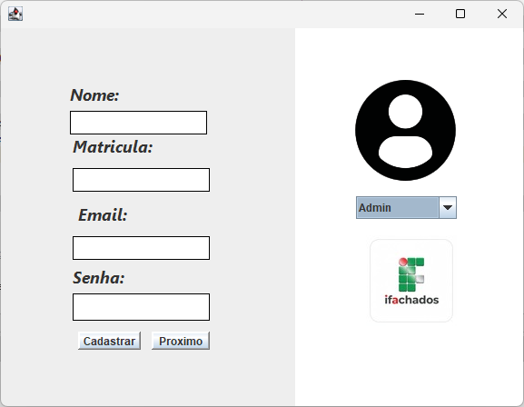
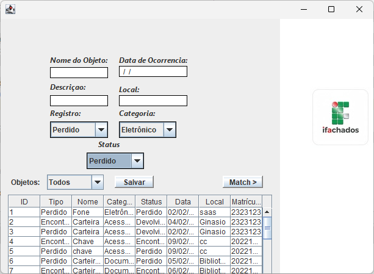
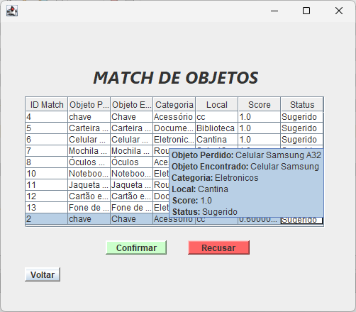
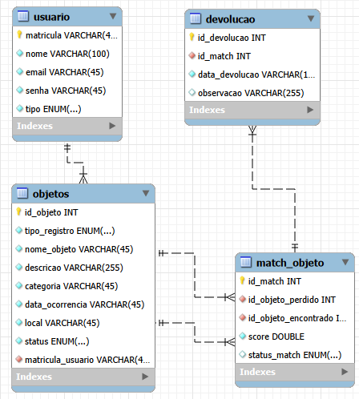

# IFAchados

Sistema desenvolvido para auxiliar no **gerenciamento de objetos perdidos e encontrados** dentro de uma instituição.

O objetivo do sistema é registrar itens perdidos ou encontrados e auxiliar na identificação dos possíveis donos através de um **mecanismo de correspondência baseado em similaridade de características**.

---

## Sobre o Projeto

O **IFAchados** foi desenvolvido como projeto acadêmico com o propósito de aplicar conceitos de:

- Programação Orientada a Objetos
- Persistência de dados com banco de dados relacional
- Arquitetura em camadas
- Desenvolvimento de interfaces desktop em Java

O sistema permite registrar objetos perdidos ou encontrados, armazenar informações relevantes e sugerir possíveis correspondências entre registros.

---

## Funcionalidades

O sistema possui as seguintes funcionalidades:

- Cadastro de usuários
- Cadastro de objetos perdidos
- Cadastro de objetos encontrados
- Registro de devolução de objetos
- Consulta de itens cadastrados
- Sistema de correspondência entre itens perdidos e encontrados
- Interface gráfica para gerenciamento das informações

---

## Algoritmo de Correspondência de Itens

O sistema possui um mecanismo de correspondência entre objetos perdidos e encontrados.

Quando um novo item é cadastrado, o sistema compara suas características com os itens existentes no banco de dados.

A análise considera:

- nome do objeto
- categoria
- local
- data da ocorrência
- descrição

Com base nessas informações é calculado um **score de similaridade**, permitindo sugerir possíveis correspondências entre objetos perdidos e encontrados.

---

## Tecnologias Utilizadas

O projeto foi desenvolvido utilizando as seguintes tecnologias:

- **Java**
- **Java Swing** (Interface gráfica)
- **MySQL**
- **JDBC**
- **Apache Ant** (build do projeto)
- **NetBeans**

---

## Arquitetura do Projeto

O projeto segue uma organização em camadas para separar responsabilidades.

### Camadas do sistema

**DAO (Data Access Object)**  
Responsável pela comunicação com o banco de dados.

**Domínio**  
Contém as classes que representam as entidades do sistema.

**UI (User Interface)**  
Responsável pela interface gráfica do sistema e interação com o usuário.

---

## Banco de Dados

O sistema utiliza **MySQL** para armazenar as informações de:

- objetos perdidos
- objetos encontrados
- usuários
- devoluções
- correspondências entre itens

A comunicação com o banco é realizada utilizando **JDBC**.

---

## Interface do Sistema

O sistema possui uma interface gráfica desenvolvida em **Java Swing**, permitindo que o usuário:

- registre novos objetos
- consulte registros existentes
- gerencie devoluções
- visualize possíveis correspondências entre itens

---

## Objetivo Acadêmico

Este projeto foi desenvolvido como parte de atividades acadêmicas com o objetivo de aplicar conceitos de:

- modelagem de sistemas
- programação orientada a objetos
- persistência de dados
- desenvolvimento de aplicações desktop

---

## Demonstração do Sistema

### Tela cadastro

### Cadastro de objeto

### Sistema de correspondência

## Estrutura do Banco de Dados

---

## Como Executar o Projeto

1. Clone o repositório

git clone https://github.com/Rubenn34/IFAchados.git

2. Crie o banco de dados executando:

database/schema.sql

3. Configure a conexão com o banco no arquivo:

src/dao/Conexao.java

4. Abra o projeto no NetBeans ou outra IDE Java.

5. Execute a aplicação.

